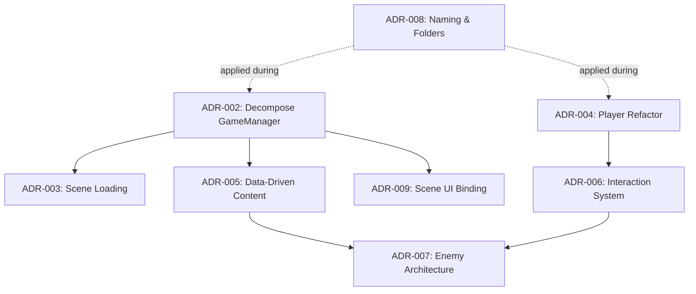

# Architecture Decision Records Index

> Last updated: 2026-05-11

## Dependency Order

## ADR Registry

| # | Title | Status | Phase | Current Note |
|---|-------|--------|-------|--------------|
| [001](001-docs-structure-and-workflow.md) | Documentation Structure & Workflow | **Accepted** | Docs | Active process |
| [002](002-decompose-gamemanager-singleton.md) | Decompose GameManager Singleton | **Accepted** | Phase 2 | Services implemented, `GameManager` kept as migration facade |
| [003](003-scene-loading-architecture.md) | Scene Loading Architecture | **Accepted** | Phase 2 | `SceneLoader` and `DoorInteractable` implemented, `SceneReference` assets still pending |
| [004](004-player-controller-refactor.md) | Player Controller Refactor | **Accepted** | Phase 2 | Runtime split implemented, `Player` kept as composition root |
| [005](005-data-driven-content-definitions.md) | Data-Driven Content Definitions | **Implemented** | Phase 3 | Runtime and definitions added |
| [006](006-unified-interaction-system.md) | Unified Interaction System | **Accepted** | Phase 2 | Interface path implemented, tag fallback retained during migration |
| [007](007-enemy-architecture.md) | Enemy Architecture | **Proposed** | Phase 3 | Seeded by `EnemyDefinition` integration |
| [008](008-naming-convention-and-folder-migration.md) | Naming Convention & Folder Migration | **Proposed** | Phase 1 | Still incremental |
| [009](009-scene-ui-binding.md) | Scene UI Binding | **Accepted** | Phase 2 | Event-driven binders implemented, `SceneInitializer` retained as bridge |

## Phase Mapping

| GDD Phase | ADRs | Current Status |
|-----------|------|----------------|
| **Phase 1** - Stabilize Prototype | ADR-008 | Partially complete |
| **Phase 2** - Split Core Runtime | ADR-002, 003, 004, 006, 009 | Implemented in code with compatibility shims |
| **Phase 3** - Data-Drive Content | ADR-005, 007 | Baseline implemented; content authoring still pending |
| **Phase 4** - Vertical Slice | Built on Phase 2 foundations | Planned |

## Current Phase 2 Shape

- Runtime services now live behind `Services` and focused MonoBehaviours: `HealthSystem`, `EnergySystem`, `FlashlightSystem`, `InventoryManager`, `DoorLockRegistry`, `SessionManager`, and `SceneLoader`.
- Player runtime logic is split into `PlayerMovement`, `PlayerInteraction`, `PlayerHiding`, and `PlayerAudio`.
- Scene UI is event-driven through `HealthUI`, `EnergyUI`, `FlashlightUI`, `InventoryHotbarUI`, and `DeathSequenceUI`.
- Compatibility wrappers remain in `GameManager`, `Player`, `SceneInitializer`, and `DoorClick` so existing scene and prefab serialization keeps working.

## Follow-Up Still Needed In Unity Editor

1. Create and assign `SceneReference` assets for live scene transitions.
2. Create and assign `PlayerSettings` assets where designer tuning should move out of inline fields.
3. Replace tag-only scene objects with direct `IInteractable` components where appropriate.
4. Remove compatibility wrappers after scene and prefab references are fully rewired.
5. Create and assign content definition assets introduced by ADR-005.
